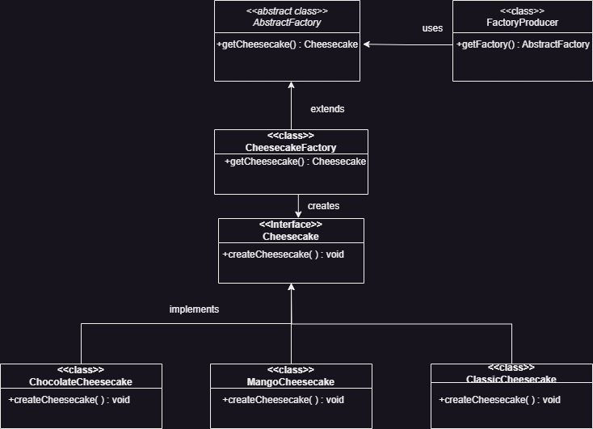
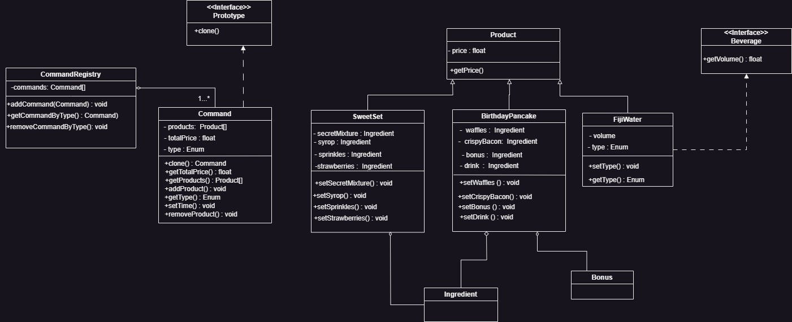
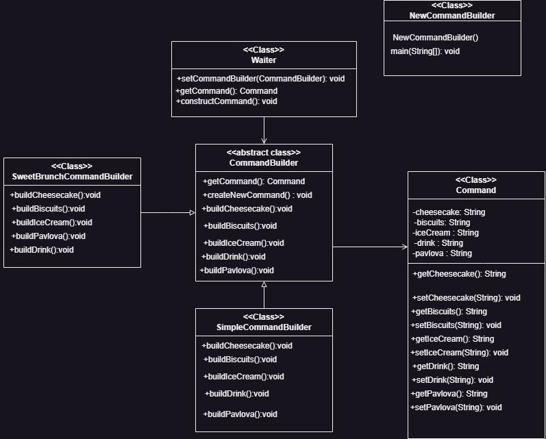
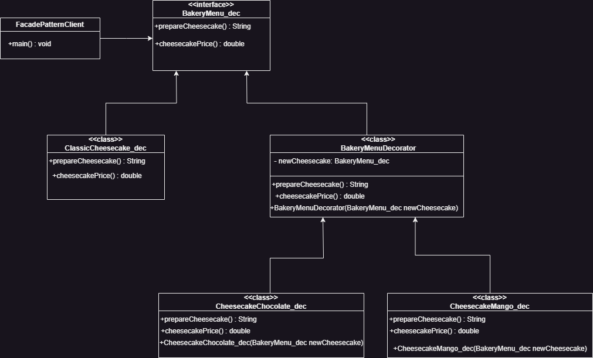
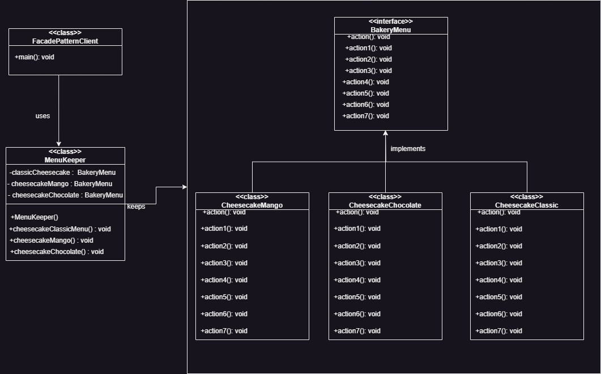
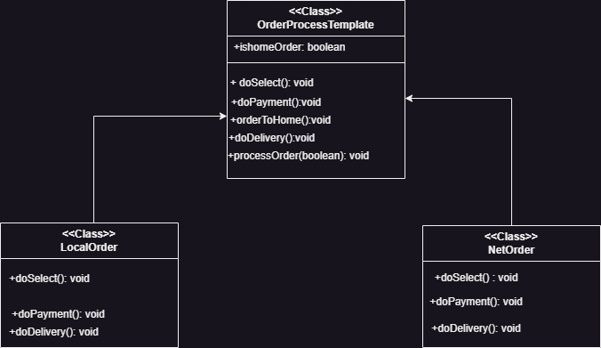

<!DOCTYPE html>
<html>
<head>
</head>
<body>
    <h1>Design Patterns Project</h1>

    <h2>Abstract Factory Pattern</h2>
    

        To avoid specifying concrete object subclasses from a family, we used the AbstractFactory pattern. The
        first thing it suggests is to explicitly declare interfaces for each distinct product of the product family.
        All variants of cheesecake (ClassicCheesecake, ChocolateCheesecake, MangoCheesecake) implement the
        Cheesecake interface. The next move is to create a list of creation methods for all products that are part of
        the product family (createCheesecake).
    

    

        

    

    

    <h2>Prototype Pattern</h2>
    

        If someone wants the same products as you, we use the Prototype design pattern to clone an existing object
        (command) instead of creating a new one. Any class that implements the Prototype interface should
        implement the clone() method, and thus the object can be cloned.
    

    

      

    

    
>

    <h2>Builder Pattern</h2>
    

        The Builder pattern allows you to create different representations of a complex object using the same
        construction process. In this case, you can choose between a line or grid menu template and also select
        whether you want to dine in or take it home.
    

    

      

    

    

    <h2>Decorator Pattern</h2>
    

        The Decorator pattern allows you to add additional behavior to an object dynamically. In the provided code,
        the Decorator pattern is used to decorate the BakeryMenu component with additional functionalities for
        different cheesecake flavors.
    

    

      

    

    

    <h2>Facade Pattern</h2>
    

        The Facade pattern provides a simplified interface for a complex subsystem. In this case, the MenuKeeper
        acts as a facade that simplifies interactions with different cheesecake flavors (subsystem classes).
    

    

      

    

    <h2>Template Method Pattern</h2>
    

        The Template Method pattern defines the skeleton of an algorithm in a base class, with specific steps that
        can be implemented by subclasses. The provided code demonstrates the usage of this pattern in menu
        template classes.
    

	

      

    

    

    

    

</body>
</html>